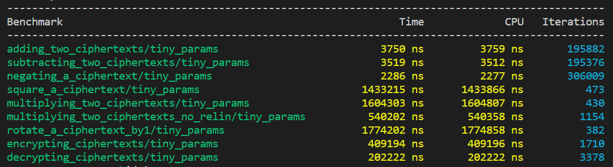
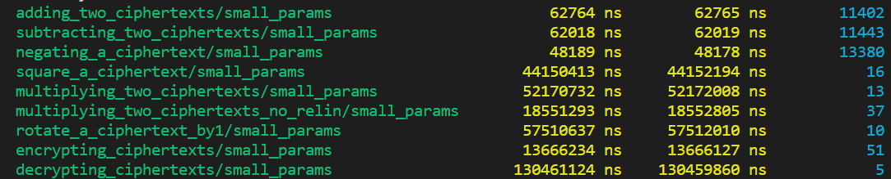

## Benchmarking of BGV Bootstrapping Algorithm

> The benchmarks have been run on a commodity desktop with a 12th Gen Intel(R) Core(TM) i5-1235U, 1300 Mhz and 16 GB of RAM, running Ubuntu 22.04.5 LTS.

The benchmarks could only be run for tiny and small params due to performance issues.

### Tiny Params

No. of slots: 16

Bits: 542

### Small Params

No. of slots: 2

Bits: 549

