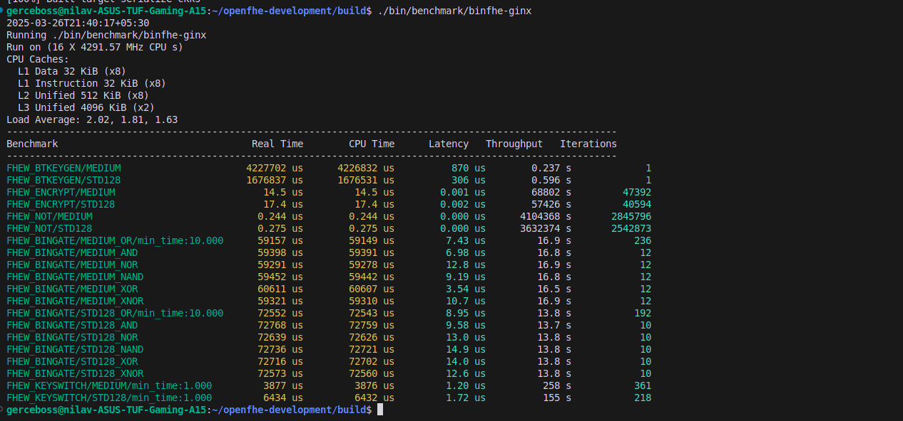
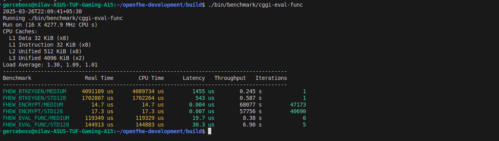

## Benchmarking of CGGI Bootstrapping Algorithm

> The benchmarks have been run on a commodity desktop with a 12th Gen Intel(R) Core(TM) i5-1235U, 1300 Mhz and 16 GB of RAM, running Ubuntu 22.04.5 LTS.

### CGGI single-bit

We ran the benchmarks for CGGI (Chillotti-Gama-Georgieva-Izabachene) bootstrapping algorithm (with 1 bit precision) given in the openFHE library for c++ using the source file `binfhe-ginx.cpp`.

No. of slots: 1

bits of precision: 1

### CGGI multi-bit

We ran the benchmarks for CGGI (Chillotti-Gama-Georgieva-Izabachene) bootstrapping algorithm (multi-bit) by writing a benchmarking file at `openfhe-development/benchmark/src/cggi-eval-func.cpp`.

No. of slots: 1

bits of precision: 3

It generates keys and then evaluates x^3%p (p=8 in image below)

NOTE: The benchmarks were run after modifying the `openfhe-development/third-party/google-benchmark/src/console_reporter.cc` file for obtaining throughput and latency metrics.
Please copy paste the file provided in this directory at mentioned location.

Throughput = slots/cpu_time

Latency = real_time-cpu_time

