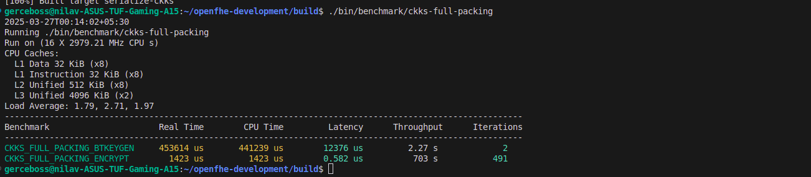
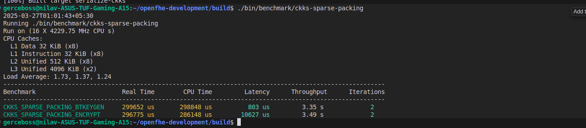
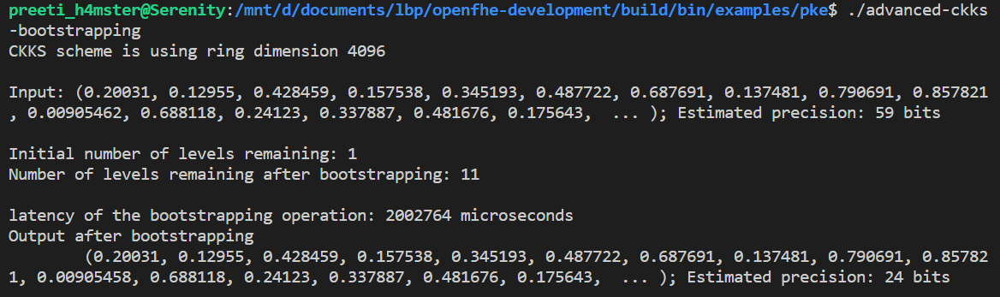
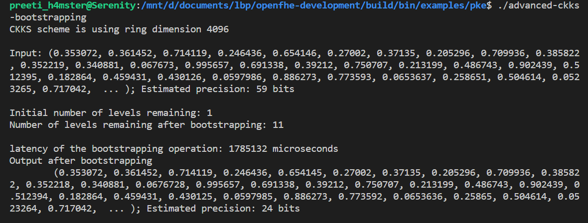
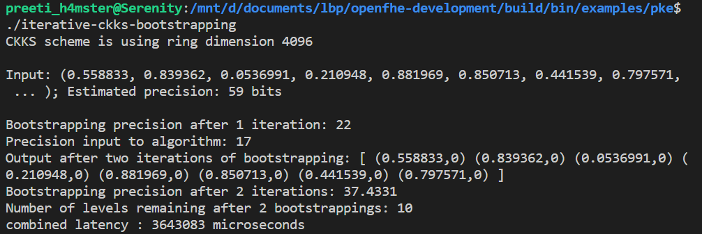

## Benchmarking of CKKS Bootstrapping Algorithm

>The benchmarks have been run on a commodity desktop with a 12th Gen Intel(R) Core(TM) i5-1235U, 1300 Mhz and 16 GB of RAM, running Ubuntu 22.04.5 LTS.

### CKKS with Full Packing

We ran the benchmarks for CKKS (Cheon-Kim-Kim-Song) bootstrapping algorithm (with full packing) by writing a benchmarking file at `openfhe-development/benchmark/src/ckks-full-packing.cpp`.

No. of slots: 2048

bits of precision: 18

### CKKS with Sparse Packing

We ran the benchmarks for CKKS (Cheon-Kim-Kim-Song) bootstrapping algorithm (with sparse packing) by writing a benchmarking file at `openfhe-development/benchmark/src/ckks-sparse-packing.cpp`.

No. of slots: 8

bits of precision: 26

No. of slots: 16

bits of precision: 24

No. of slots: 32

bits of precision: 24

### CKKS with 2 iterations

We ran the benchmarks for CKKS (Cheon-Kim-Kim-Song) bootstrapping algorithm (2 iterations) given in the openFHE library for c++ using the source file `iterative-ckks-bootstrapping.cpp`. Sparse packing has been used for running the iterations.

No. of slots: 8

precision after 1st iteration: 22

precision after 2nd iteration: 37

NOTE: The benchmarks were run after modifying the `openfhe-development/third-party/google-benchmark/src/console_reporter.cc` file for obtaining throughput and latency metrics.
Please copy paste the file provided in this directory at mentioned location.

Throughput = slots/cpu_time

Latency = real_time-cpu_time
