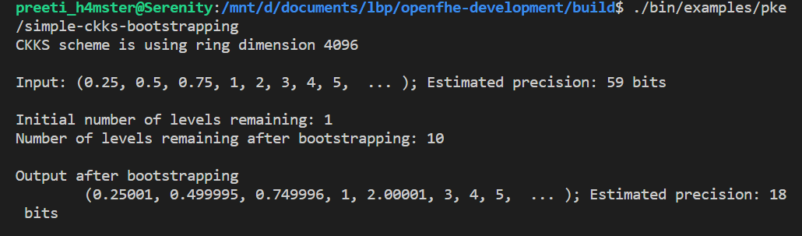
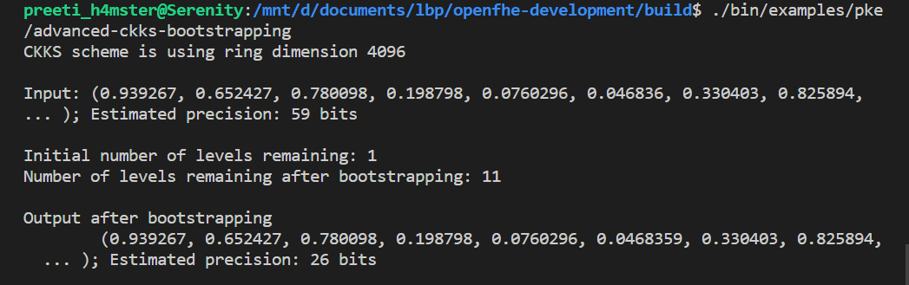

## Benchmarking of CKKS Bootstrapping Algorithm

>The benchmarks have been run on a commodity desktop with a 12th Gen Intel(R) Core(TM) i5-1235U, 1300 Mhz and 16 GB of RAM, running Ubuntu 22.04.5 LTS.

### CKKS with Full Packing

We ran the benchmarks for CKKS (Cheon-Kim-Kim-Song) bootstrapping algorithm (with full packing) given in the openFHE library for c++ using the source file `simple-ckks-bootstrapping.cpp`.

No. of slots: 2048

bits of precision: 18

### CKKS with sparse Packing

We ran the benchmarks for CKKS (Cheon-Kim-Kim-Song) bootstrapping algorithm (with sparse packing) given in the openFHE library for c++ using the source file `advanced-ckks-bootstrapping.cpp`.

No. of slots: 8

bits of precision: 26

